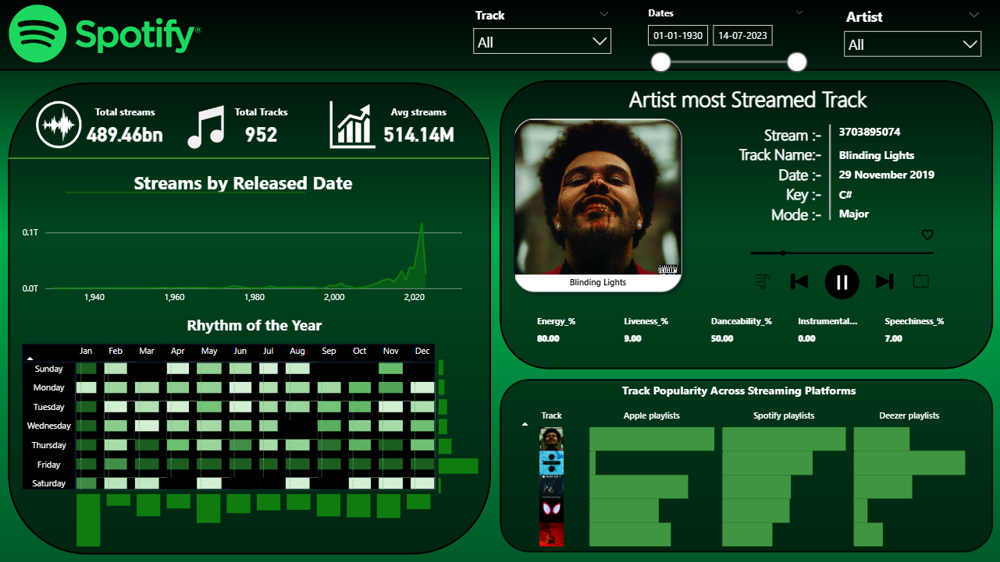

# Spotify Analytics Dashboard

A comprehensive Spotify analytics dashboard that provides deep insights into music streaming data with interactive visualizations and detailed track information. Built with a sleek green interface matching Spotify's design language.



## 🎵 Features

### 📊 Core Analytics
- **Stream Statistics**: Total streams (489.46bn), total tracks (952), and average streams (514.14M)
- **Date Range Filtering**: Customizable date selection (01-01-1930 to 14-07-2023)
- **Track & Artist Filtering**: Dropdown filters for specific tracks and artists

### 📈 Advanced Visualizations
- **Streams by Release Date**: Interactive line chart showing streaming trends over decades
- **Rhythm of the Year**: Heat map calendar showing streaming patterns by day of week and month
- **Track Popularity Comparison**: Cross-platform analytics for Apple, Spotify, and Deezer playlists

### 🎶 Track Details Panel
- **Most Streamed Track**: Featured track display with album artwork
- **Audio Features Analysis**: Energy, Liveness, Danceability, Instrumentalness, and Speechiness metrics
- **Track Metadata**: Release date, key signature, and mode information
- **Integrated Music Player**: Play controls with track navigation

### 🌐 Multi-Platform Insights
- **Cross-Platform Analytics**: Compare track performance across streaming services
- **Playlist Penetration**: Visual comparison of track presence in different platform playlists

## 🚀 Technologies Used

- **Frontend**: Modern web technologies with interactive visualizations
- **Data Visualization**: Custom charts and heat maps for streaming analytics
- **APIs**: Spotify Web API, Apple Music API, Deezer API
- **UI/UX**: Spotify-inspired green theme with dark mode design
- **Charts**: Time-series analysis and calendar heat maps
- **Audio Analysis**: Integration with Spotify's audio features API

## 📋 Prerequisites

Before running this project, make sure you have:

- Node.js (version X.X or higher)
- A Spotify Developer Account
- [Any other dependencies]

## 🛠️ Installation

1. **Clone the repository**
   ```bash
   git clone https://github.com/harshyad24/Spotify.git
   cd Spotify
   ```

2. **Install dependencies**
   ```bash
   npm install
   # or
   yarn install
   ```

3. **Set up API credentials**
   - Go to [Spotify Developer Dashboard](https://developer.spotify.com/dashboard)
   - Create a new app and get your credentials
   - Optionally set up Apple Music and Deezer API access for cross-platform data
   - Create a `.env` file in the root directory:
   ```env
   SPOTIFY_CLIENT_ID=your_spotify_client_id
   SPOTIFY_CLIENT_SECRET=your_spotify_client_secret
   SPOTIFY_REDIRECT_URI=http://localhost:3000/callback
   APPLE_MUSIC_KEY=your_apple_music_key (optional)
   DEEZER_API_KEY=your_deezer_key (optional)
   ```

4. **Run the application**
   ```bash
   npm start
   # or
   yarn start
   ```

5. **Open your browser**
   Navigate to `http://localhost:3000`

## 🎯 Usage

1. **Load Your Data**: Import your Spotify streaming data or connect via API
2. **Set Date Range**: Use the date picker to analyze specific time periods (supports historical data back to 1930)
3. **Filter Content**: Use track and artist dropdowns to focus on specific music
4. **Explore Analytics**: 
   - View streaming trends over decades in the release date chart
   - Analyze your listening patterns in the "Rhythm of the Year" calendar
   - Compare track performance across different streaming platforms
5. **Track Details**: Click on tracks to see detailed audio features and metadata
6. **Cross-Platform Insights**: Compare how tracks perform on Spotify, Apple Music, and Deezer playlists

## 📊 Dashboard Components

### Main Statistics Panel
- **Total Streams**: 489.46 billion streams analyzed
- **Total Tracks**: 952 unique tracks in dataset
- **Average Streams**: 514.14M streams per track

### Visualization Panels
- **Streams by Release Date**: Historical streaming data visualization from 1940-2020
- **Rhythm of the Year**: Heat map showing streaming activity patterns by day and month
- **Artist Spotlight**: Featured track with album artwork and audio analysis
- **Cross-Platform Comparison**: Track popularity across Apple playlists, Spotify playlists, and Deezer playlists

### Audio Features Analysis
- **Energy**: Track energy level (0-100%)
- **Liveness**: Live performance detection
- **Danceability**: How suitable a track is for dancing
- **Instrumentalness**: Vocal content detection
- **Speechiness**: Spoken word detection

## 📧 Contact

Harsh Yadav - [@harshyad24](https://github.com/harshyad24)

Project Link: [https://github.com/harshyad24/Spotify](https://github.com/harshyad24/Spotify)


## 🌟 Example Data

The dashboard currently showcases analysis of:
- **Featured Track**: "Blinding Lights" by The Weeknd (3.7B+ streams)
- **Historical Range**: Music data spanning from 1930 to 2023
- **Audio Profile**: High energy (80%), low liveness (9%), moderate danceability (50%)
- **Cross-Platform Presence**: Analysis across Apple Music, Spotify, and Deezer playlists

---

⭐ Star this repository if you found it helpful!
